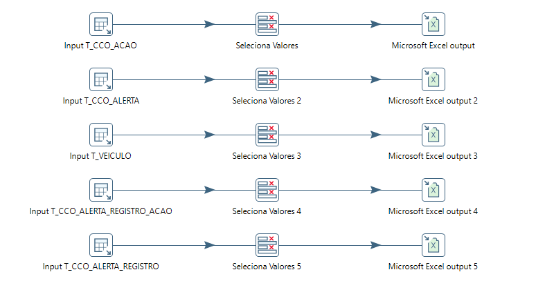
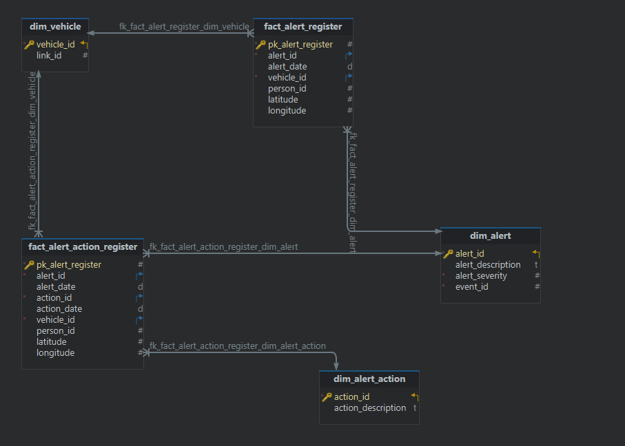

# Análise de Alertas - MagisDev (Michelin Connected Fleet)

**Objetivo:**
Realizar análises estratégicas sobre os alertas gerados pelo sistema TMS (_Transport Management System_) da **MagisDev** (solução _Michelin Connected Fleet_), identificando padrões de severidade, frequência e impacto operacional para otimizar a gestão de frotas conectadas.

## Definição de Alertas no TMS

_Alertas_ são registros automatizados gerados quando condições pré-configuradas são atendidas durante a ocorrência de _eventos operacionais_ (como direção, frenagem brusca ou perda de sinal).

### Características-chave:

-   Acionados por _regras parametrizáveis_ no sistema
-   Associados a _eventos específicos_ da operação
-   Priorizados por níveis de severidade (`Baixa`, `Média`, `Alta`)
-   Integrados aos fluxos de _tomada de decisão_ dos usuários

## Definição de Ações sob Alertas no TMS

_As ações_ representam comandos executáveis enviados pelos operadores do sistema TMS para tratamento de alertas identificados, podendo assumir duas naturezas distintas:

### Características-chave:

-   **Associação direta**
    Vinculadas a alertas específicos através de:

    -   ID do alerta
    -   Data/Hora correspondente

-   **Tipos de tratamento**:
    -   ✅ **Solução definitiva**
        _Exemplo_: Problema Mecânico finalizado
    -   ⏳ **Inibição temporária**
        _Exemplo_: Inibir Alerta

## Objetivos da Análise de Alertas no TMS

### Perguntas-Chave a Serem Respondidas:

1. **Volume Geral**

    - ✅ `Qual o total de alertas?`
      _Métrica base para dimensionamento do problema_

2. **Foco nos Agentes**

    - 🚛 `Quais são os 5 motoristas com maior incidência de alertas e suas quantidades?`
      _(Dados anonimizados para conformidade com LGPD)_

3. **Classificação por Risco**

    - 🚨 `Qual a distribuição de alertas por severidade?`
        - /Baixa/Média/Alta
    - 🚨 `Quais são os alertas mais recorrentes?`

4. **Geografia Operacional**

    - 📍 `Onde estão concentrados os alertas no mapa?`
      _Hotspots geográficos_

5. **Eficiência de Resposta**

    - ⏱️ `Qual o tempo médio para lançamento de ações de solução definitiva?`
      _Métrica de eficácia operacional_

6. **Evolução Temporal**
    - 📅 `Qual a variação percentual de cada severidade mensalmente?`
    - 📈 `Como evoluiu a curva de alertas ao longo dos meses?`

### Bases de Dados Utilizadas:

| Tabela                       | Finalidade                       | Proteção de Dados                     |
| ---------------------------- | -------------------------------- | ------------------------------------- |
| `T_CCO_ACAO`                 | Cadastro das ações               | -                                     |
| `T_CCO_ALERTA`               | Cadastro dos alertas             | -                                     |
| `T_VEICULO`                  | Cadastro dos veículos            | Anonimização de veículos              |
| `T_CCO_ALERTA_REGISTRO_ACAO` | Registro de alertas tratados     | Anonimização de motoristas e veículos |
| `T_CCO_ALERTA_REGISTRO`      | Registro de alertas não tratados | Anonimização de motoristas e veículos |

## Captação e Extração de Dados

### Fluxo de ETL Implementado

Foi utilizado o **Pentaho Data Integration (PDI)** para construção do seguinte pipeline de extração:



Vale ressaltar que o processo de tratamento de dados/colunas será realizado em uma próxima etapa.
Foram considerados para as tabelas `T_CCO_ALERTA_REGISTRO_ACAO` e `T_CCO_ALERTA_REGISTRO` apenas registros referentes ao ano de 2024.
Os arquivos foram gerados em formato _.csv_ e _.xlsx_

## Processo de Anonimização de Dados

### Objetivo

Garantir a conformidade com LGPD através da substituição de dados sensíveis por identificadores não pessoais antes da carga no Databricks.

### Tabelas Processadas

-   `T_CCO_ALERTA_REGISTRO_ACAO`
-   `T_CCO_ALERTA_REGISTRO`

### Método Implementado

1. **Substituição de Identificadores**:

    - Campo original: `D_PLACA` (placa do veículo)
    - Substituído por: `C_VEICULO` (código interno anônimo da tabela `T_VEICULO`)

2. **Remoção de Campos**:
    - Remoção do campo `D_PLACA`

```python
import pandas as pd

# Importando as tabelas
tabela_veiculos = pd.read_excel('T_VEICULO.xlsx')
tabela_alertas = pd.read_excel('T_CCO_ALERTA_REGISTRO.csv')
tabela_acao = pd.read_excel('T_CCO_ALERTA_REGISTRO_ACAO.csv')

# Anonimizando as tabelas
tabela_alertas = pd.merge(tabela_alertas, tabela_veiculos[['D_PLACA', 'C_VEICULO']], on='D_PLACA', how='left')
tabela_acao = pd.merge(tabela_acao, tabela_veiculos[['D_PLACA', 'C_VEICULO']], on='D_PLACA', how='left')

# Removendo a coluna D_PLACA
tabela_alertas = tabela_alertas.drop(columns=['D_PLACA'])
tabela_acao = tabela_acao.drop(columns=['D_PLACA'])

# Salvando as tabelas anonimizadas
tabela_alertas.to_csv('T_CCO_ALERTA_ANONIMIZADO.csv', index=False)
tabela_acao.to_csv('T_CCO_ALERTA_REGISTRO_ACAO_ANONIMIZADO.csv', index=False)

print('Tabelas anonimizadas com sucesso!')
```

## Processamento no Databricks

### Ambiente Utilizado

-   **Plataforma**: Databricks Community Edition
-   **Cluster**:
    -   Databricks Runtime Version: `12.2 LTS (includes Apache Spark 3.3.2, Scala 2.12)`
    -   Driver type: Community Optimized

### Notebook Principal

[](https://databricks-prod-cloudfront.cloud.databricks.com/public/4027ec902e239c93eaaa8714f173bcfc/2703224462378819/3795264950545180/1418077847705646/latest.html)

**Fluxo de Trabalho**:

1. Carga dos dados anonimizados
2. Transformações Spark SQL/Python
3. Armazenamento em Delta Lake

## Modelagem de Banco de Dados

A estrutura escolhida foi um StarSchema que pode ser visualizada na imagem abaixo gerada pelo software _DB Schema_:



### Tabelas de Dimensão

| Tabela               | Descrição                            | Chaves           | Relacionamentos                                                                 |
| -------------------- | ------------------------------------ | ---------------- | ------------------------------------------------------------------------------- |
| **dim_vehicle**      | Armazena informações dos veículos    | PK: `vehicle_id` | FK em `fact_alert_register` (1:n) <br> FK em `fact_alert_action_register` (1:n) |
| **dim_alert**        | Contém o cadastro de tipos de alerta | PK: `alert_id`   | FK em `fact_alert_register` (1:n) <br> FK em `fact_alert_action_register` (1:n) |
| **dim_alert_action** | Define os tipos de ações disponíveis | PK: `action_id`  | FK em `fact_alert_action_register` (1:n)                                        |

### Tabelas de Fato

| Tabela                         | Descrição                            | Chaves                  |
| ------------------------------ | ------------------------------------ | ----------------------- |
| **fact_alert_register**        | Registra ocorrências de alertas      | PK: `pk_alert_register` |
| **fact_alert_action_register** | Armazena alertas com ações aplicadas | PK: `pk_alert_register` |

# Análise de Alertas - Principais Insights


## 1. Sazonalidade e Efetividade das Ações Corretivas

📈 **Padrão observado:**
Nos primeiros meses do ano foram registrados os maiores picos na quantidade de alertas.

✅ **Interpretação:**
As medidas de controle implementadas demonstraram efetividade na redução progressiva dessas ocorrências.

---

## 2. Destaque para Comportamento Individual

⚠️ **Dado relevante:**
Diferença significativa entre o 1° e 2° motoristas com maior número de alertas.

🔧 **Recomendação:**
Ações personalizadas de correção de comportamento para o colaborador em destaque.

---

## 3. Principais Tipos de Ocorrências

📡 **Alerta predominante:**
_Perda de sinal_ (interrupção na conexão com equipamento rastreador)

🛠️ **Sugestões:**

-   Verificação periódica dos dispositivos
-   Análise de cobertura de rede nas rotas

---

## 4. Distribuição por Severidade

🟢 **Perfil positivo:**
Predominância de alertas de _baixa severidade_ (majoritariamente informativos)

🔍 **Implicação:**
Cenário onde a maioria das ocorrências não representa riscos críticos.
